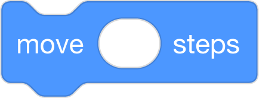
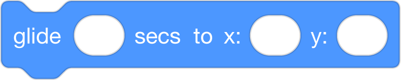
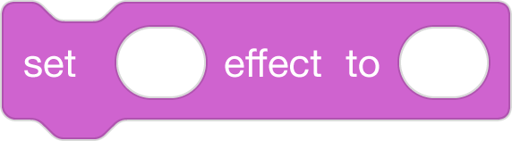
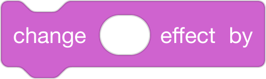
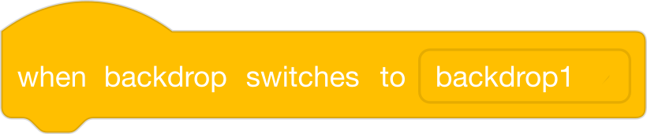
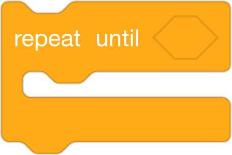
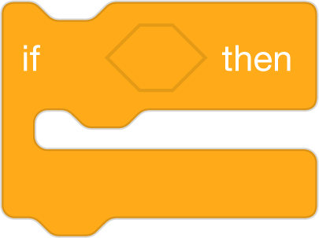
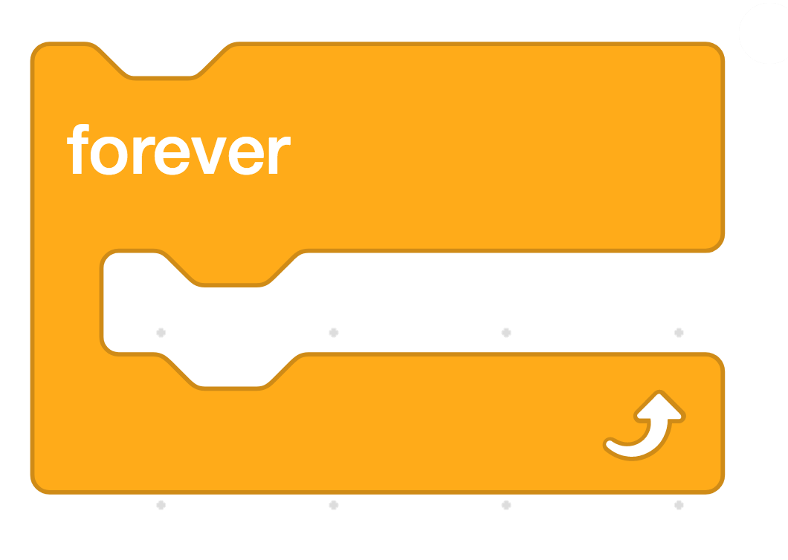
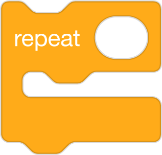

# Scaffolding Techniques
#### by Block 19
Roster: Alana Robinson, Ashley Ufret, Shana Elizabeth Henry, Qianhui Vanessa Zou

Your Name/Team: Block 19

Programming Language:  Scratch

Scaffold: Storyboard/UDL

## Objective: Use code to describe the pattern in the text with Loops.

Read aloud "Goldilocks and Three Bears", explain that stories have patterns that we can use to make predictions. We can find the patterns by looking for repetion in the text. Can we find the loop in the story? Can we use code to show the loop? 

Big Idea/Understanding: In code we use a repeat block to create a loop.

### Task: Listen to the read aloud, Goldilocks and Three Bears. Identify the loop in the story and use Scratch blocks to show the loop. 

 ####  Activity: Use code to describe the pattern in the text with Loops. Students will learn how a pattern in a story is connected to a loop in CS. They will use block based code to describe the pattern/loop in the text Goldilocks and the Three Bears.
Use code to describe the pattern/loop in the text Goldilocks and the Three Bears.

### Resources:
* Printable (Text Only) Version:https://www.dltk-teach.com/rhymes/pgoldilocks_story.asp

* Video Version Read-Aloud:https://www.dltk-teach.com/rhymes/pgoldilocks_story.asp

* Scratch:https://scratch.mit.edu,

### UDL/Differentiation Options: Students chose which activity they want to work on with Scratch Code Blocks/Task  Cards

UDL/Differentiation Options: Students chose which activity they want to work on with Scratch Code Blocks/Task Cards

Student choice based on interest and skill level: Student choose an activity based on what they think their skill level is and based on their interest:

* **First**, students work in unplugged with the Scratch Task Cards 
* **Second**, students program their code in Scratch and can work in strategic pairs as driver/navigator. Log into Scratch @ https://scratch.mit.edu, then run/debug as necessary.
  

 1. Students are given a task card and 5-6 Scratch blocks that are out of order. Students 
  have to reorder those blocks to show a loop/repetition in the story. 
  (i.e. Repeat Block, speak block (Basic)

* Use repetition.(Basic)

https://scratch.mit.edu, then run/debug as necessary.
  

2. Students will have to determine which scratch blocks they need to 
* demonstrate the loop in the story. (Intermediate) 
 

https://scratch.mit.edu, then run/debug as necessary.
* 
3. Students will retell the story to determine what number they would have to show in the loop to show how many items Goldilocks tried something in the bears home (until she found the one that was just right).
* (Advanced)

 

