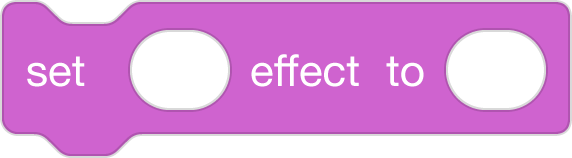
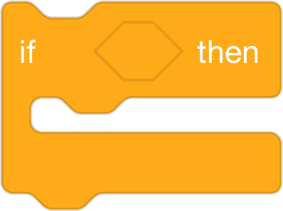
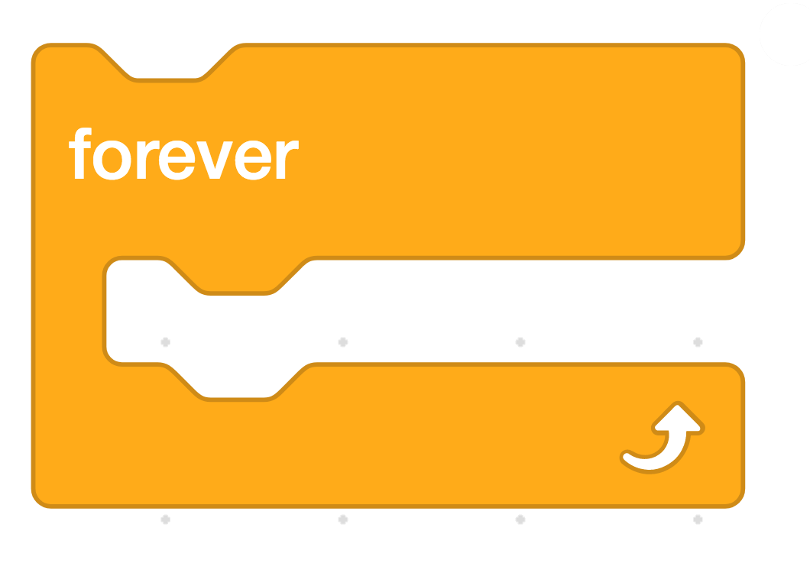

# Scaffolding Techniques
#### by Block 19
Roster: Alana Robinson, Ashley Ufret, Shana Elizabeth Henry, Qianhui Vanessa Zou

Programming Language:  Scratch

Scaffold: Storyboard

Activity: Use code to describe the pattern in the text with Loops.

Students are provided the scratch solution code blocks. 

### UDL/Differentiation Options: Students chose which activity they want to work on with Scratch Code Blocks/Task Cards

### CHOICES: A -(BASIC) SKILL LEVEL | B - (INTERMEDIATE) SKILL LEVEL | C - (ADVANCED) SKILL LEVEL

### Students are given 5-6 Scratch blocks that are out of order and they need to reorder those blocks to show a loop/repetition in the story using Scratch Blocks/Task Cards (Basic)

* SOLUTION (Basic)
 (Sequence Code in this order: Use Block 1)
  (Sequence Code in this order: Use Block 2)
  (Sequence Code in this order: Use Block 3)
 (Sequence Code in this order: Use Block 4)
 (Sequence Code in this order: Use Block 5)

2. Students will select the scratch blocks that will demonstrate a loop in the story using Scratch Blocks/Task Cards 
* SOLUTION (Intermediate) Various Outcomes
  
* Students will put the when green flag clicked on top, then put the say/start sound block inside the repeat block. They will have the say/start sound block, include the part of the text that is repeated in the text. They may have additional features such as costumes/sprites for the chair, bed with the different sizes. They would use this plan to complete the project on https://scratch.mit.edu, then run/debug as necessary.

 (Sequence Code in this order: Use Block 1)
 

3. Students will re-create a scene from the story using 2 types of loop blocks (forever) and (repeat) using Scratch Blocks/Task Cards.
* SOLUTION (Advanced) Various Outcomes
* Solution: Students will put the when green flag clicked on top, then put the say/start sound block inside the repeat block. The solution would include the repeat loop with the number of repitions == to the number of times Goldilocks repeats the loop of this one is "too big, this one is too small, this one is juuust right!" This can vary depending on the version of the story used, but for the example text provided in the lesson resources it would be Repeat 3 (porridge, chair, bed). They will have the say/start sound block, include the part of the text that is repeated in the text. They may have additional features such as costumes/sprites for the chair, bed with the different sizes.

 
 

